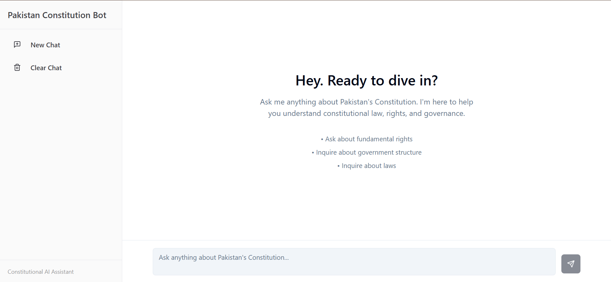
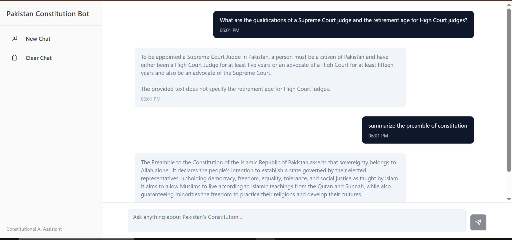

# Constitution Bot

A **RAG-based chatbot** that answers queries about the **Constitution of Pakistan (1973)**.  
It uses **LangChain**, **ChromaDB**, **Google Gemini API**, and a **React + Vite + Tailwind frontend**.

## Features
- **Chatbot** trained on the Constitution of Pakistan (1973)  
- **Retrieval-Augmented Generation (RAG)** for fact-based answers  
- **Summarization mode** (if you ask "summarize", "explain", "simplify")  
- **Conversation memory** for context-aware replies  
- **FastAPI backend** with CORS enabled  
- **Frontend in React + Vite + Tailwind**

## Project Structure
main/  

│── backend/ # FastAPI backend with RAG pipeline  

│── frontend/ # React + Vite + Tailwind frontend  
 
└── README.md


## Setup Instructions

### 1. Clone the Repository
```bash
git clone https://github.com/abdullah-umar-22/constitution-bot.git
cd constitution-bot
```

### 2. Backend Setup
```bash
cd backend
pip install -r requirements.txt
```
### Run Ingestion(Run only if you want to make your own chunks)
```bash
python ingest.py
```
### Start FastAPI Server
```bash
uvicorn main:app --reload --port 8000
```

### Frontend Setup
```bash
cd frontend
npm install
npm run dev
```

## Screenshots

### Home Page


### Chat in Action

